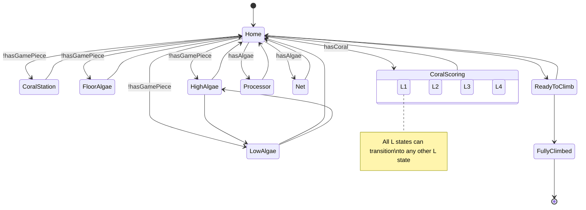
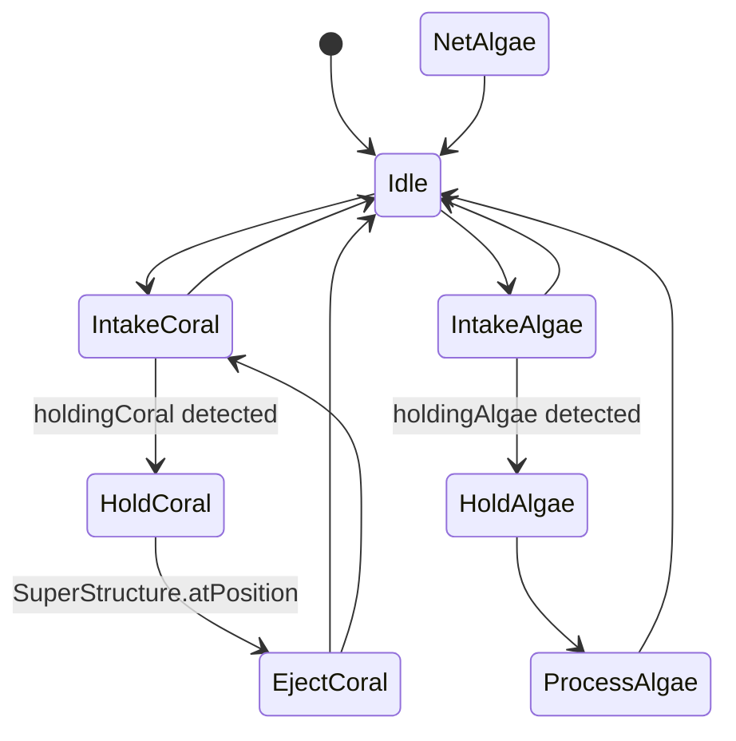
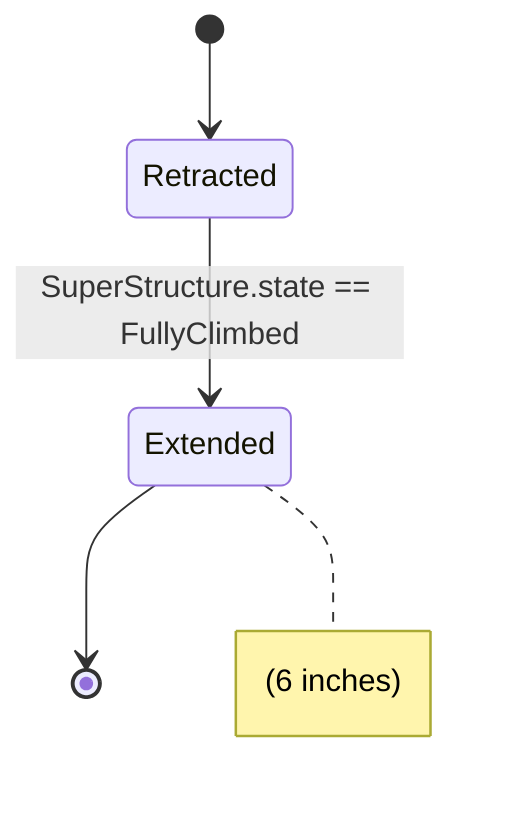
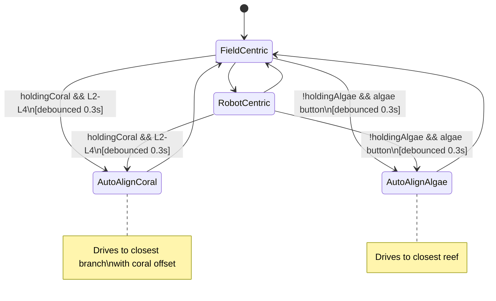
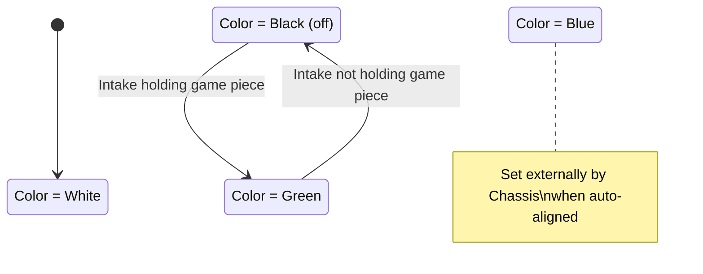

# State Machine Diagrams

This document contains MermaidJS state diagrams for each subsystem's state machine.

## 1. SuperStructure State Machine

Controls the arm assembly (pivot, elevator, wrist) positioning for scoring game pieces.

## 2. Intake State Machine

Manages game piece acquisition and control using torque/current sensing.

## 3. Climber State Machine

Controls the end-game climbing mechanism.

## 4. Chassis (Drivetrain) State Machine

Manages swerve drivetrain control with auto-alignment features.

## 5. LED Subsystem State Machine

Provides visual feedback through addressable LEDs.

